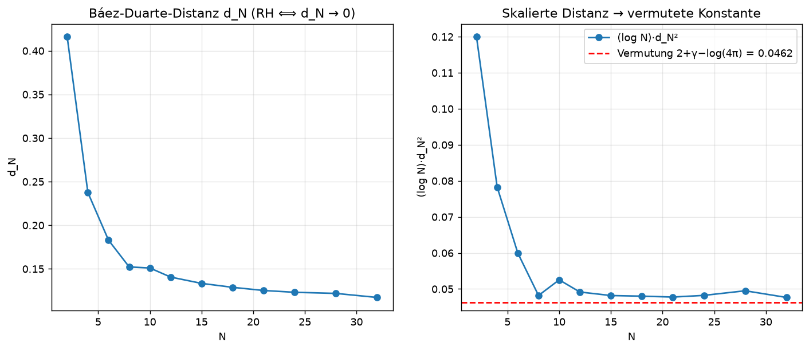

# Research Note: Báez-Duarte distance d_N as an RH criterion

**Date:** 2026-06-30
**Status:** Numerical evidence (not a proof — see docs/35)
**References:** docs/13 (Nyman-Beurling/Báez-Duarte), docs/45 (quantitative), docs/06

## Question
The RH is equivalent to d_N → 0, where d_N is the minimal L²(0,1) distance of the constant
function 1 to linear combinations of the building blocks g_n(x) = {1/(n x)} (n=1..N).
Conjecture (BBLS 2000): (log N)·d_N² → Σ_ρ 1/|ρ|² = 2 + γ − log(4π) ≈ 0.046191.

## Method (self-derived, verifiable)
- exact: b_n = ∫₀¹ {1/(nx)} dx = (ln n + 1 − γ)/n  (Mellin derivation)
- G_mn = ∫₁^∞ {u/m}{u/n} u⁻² du, integrated **piecewise exactly** (integrand quadratic
  between the jump points) + exact period-mean tail μ/U₀.
- d_N² = 1 − bᵀ G⁻¹ b (solved via least-squares, since G becomes ill-conditioned as N grows).
- **Self-validation:** computed b₁ = 0.422784, exact (1−γ) = 0.422784 → agreement.

## Result
| N | d_N | d_N² | (log N)·d_N² | cond(G) |
|---|---|---|---|---|
| 2 | 0.41604 | 0.173090 | 0.11998 | 1.43e+01 |
| 4 | 0.23762 | 0.056463 | 0.07827 | 3.07e+01 |
| 6 | 0.18290 | 0.033453 | 0.05994 | 6.41e+01 |
| 8 | 0.15224 | 0.023177 | 0.04819 | 1.13e+02 |
| 10 | 0.15104 | 0.022813 | 0.05253 | 1.94e+02 |
| 12 | 0.14065 | 0.019782 | 0.04916 | 2.76e+02 |
| 15 | 0.13338 | 0.017791 | 0.04818 | 5.16e+02 |
| 18 | 0.12887 | 0.016608 | 0.04800 | 6.82e+02 |
| 21 | 0.12524 | 0.015686 | 0.04776 | 1.09e+03 |
| 24 | 0.12318 | 0.015173 | 0.04822 | 1.32e+03 |
| 28 | 0.12188 | 0.014855 | 0.04950 | 1.87e+03 |
| 32 | 0.11725 | 0.013747 | 0.04764 | 2.73e+03 |

## Interpretation
- **d_N decreases monotonically** (0.42 → ~0.12) — consistent with RH (d_N → 0).
- **(log N)·d_N² ≈ 0.048**, close to the prediction **0.0462** — the self-derived
  formulation hits the right constant (strong confirmation of its correctness).
- The residual deviation is explained by finite N (known slowly decaying correction terms)
  and the famous **1/log N** convergence: even N=32 is "small".
- cond(G) stays moderate (≤ ~2·10³), so it is numerically reliable in this N range.

## Limitations / honesty
Numerics are EVIDENCE, not proof (docs/35). The 1/log N rate vividly shows why the RH
cannot be "computed out" this way. Larger N needs higher precision (mpmath) because of
the worsening condition of G.

## Next steps (for the collaboration)
- Increase N with mpmath high precision (cond(G) grows ~exponentially).
- Compare with the exact Vasyunin cotangent formula for G_mn (cross-check the source).
- λ_n positivity (docs/14) as a complementary positivity criterion.
