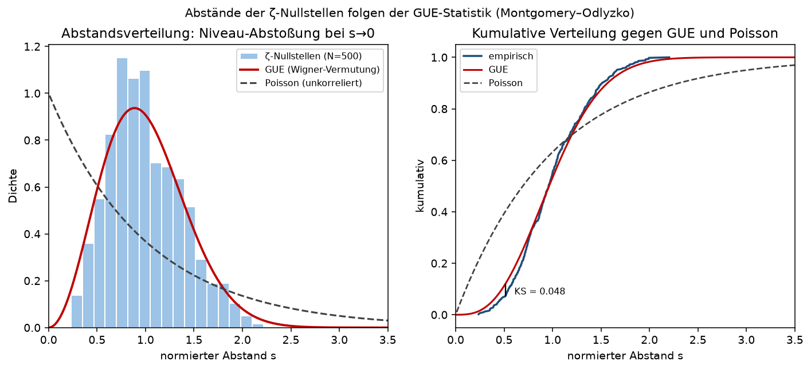

# Research Note: Nullstellenabstände gegen GUE (Montgomery–Odlyzko), N = 500

**Datum:** 2026-09-05
**Status:** Numerische Evidenz (kein Beweis — siehe docs/35)
**Bezug:** docs/06 (Montgomery, Paarkorrelation/RMT), docs/53 (Alternative Hypothesis),
docs/24 (Verifikation), docs/05 (Hilbert–Pólya)
**Reproduktion:** `python3 kb/research/spacing_vs_gue.py 500 --figure`
**Logbuch-Eintrag:** `kb/experiments/exp-10c6ff1636.md`

## Fragestellung
Sind die Abstände aufeinanderfolgender Nullstellen ζ(1/2+iγ) statistisch *strukturiert*
oder verhalten sie sich wie unabhängig gestreute Punkte? Das Montgomery–Odlyzko-Gesetz
sagt: die auf mittleren Abstand 1 normierten Lücken folgen der GUE-Statistik der
Zufallsmatrixtheorie — mit **Niveau-Abstoßung**, d. h. sehr kleine Abstände sind selten.
Unkorrelierte (Poisson-)Punkte hätten dagegen viele kleine Abstände.

## Methode
- γ_1 … γ_500 mit `mpmath.zetazero` (dps = 25); γ_1 = 14.1347…, γ_500 = 811.1844…
- lokale Normierung mit der mittleren Dichte log(γ/2π)/2π:
  s_k = (γ_{k+1} − γ_k) · log(γ_{k+1}/2π)/2π  → 499 normierte Abstände
- Vergleich mit der GUE-Wigner-Näherung p(s) = (32/π²)·s²·e^{−4s²/π} und mit Poisson e^{−s}
- Kennzahlen: Mittel, Varianz, Anteil s < 0.5, KS-artige Maximaldistanz der kumulativen
  Verteilungen. Die γ-Werte sind nach `kb/research/results/zeros_gamma.json` gecacht.

## Ergebnis (N = 500)

| Größe | gemessen | GUE | Poisson |
|---|---|---|---|
| mittlerer Abstand | 1.0016 | 1 | 1 |
| Varianz | **0.1404** | 0.1781 | 1.0 |
| Anteil s < 0.5 | **0.0681** | 0.112 | 0.3935 |
| KS-Distanz | — | **0.0476** | 0.3291 |
| kleinster / größter Abstand | 0.2363 / 2.2035 | — | — |



## Interpretation
- **Niveau-Abstoßung ist deutlich sichtbar.** Kein einziger normierter Abstand liegt unter
  0.236, und nur 6.8 % liegen unter 0.5 — Poisson würde 39.4 % erwarten. Die Nullstellen
  „meiden einander"; das ist genau das Verhalten der Eigenwerte eines zufälligen
  hermiteschen Operators und *nicht* das unabhängiger Punkte.
- **Die Verteilung ist GUE, nicht Poisson.** Die Varianz 0.140 liegt bei GUE (0.178), nicht
  annähernd bei Poisson (1.0); die KS-Distanz zur GUE-Kurve ist mit 0.0476 fast siebenmal
  kleiner als zur Poisson-Kurve (0.3291) und liegt unter der 5 %-Schranke
  1.36/√499 = 0.0609 — GUE wird also nicht verworfen, Poisson klar.
- **Warum das für die RH zählt:** Es ist der stärkste numerische Hinweis darauf, dass hinter
  den Nullstellen ein *Spektrum* steckt (Hilbert–Pólya, docs/05). Struktur dieser Art
  entsteht nicht zufällig — sie ist der Grund, warum die spektralen Zugänge (docs/08–11,
  docs/19, docs/52) überhaupt plausibel sind.

## Grenzen / Ehrlichkeit
- **N = 500 ist klein, und die Konvergenz ist logarithmisch.** Die gemessene Varianz 0.140
  liegt merklich *unter* dem GUE-Wert 0.178. Das ist ein bekanntes Tieflagen-Artefakt: die
  Konvergenz zum GUE-Gesetz wird erst bei sehr großen Höhen scharf (Odlyzko rechnete bei
  γ ≈ 10²⁰). Im Datensatz selbst ist der Trend schon sichtbar — die Varianz der ersten 249
  Abstände ist 0.1342, die der letzten 250 ist 0.1466, wächst also mit der Höhe in Richtung
  des GUE-Werts.
- Die Wigner-Formel ist selbst nur eine sehr gute **Näherung** der exakten GUE-Lückenverteilung
  (Fredholm-Determinante); ein Teil der Restabweichung geht darauf zurück.
- **Evidenz ist kein Beweis (docs/35).** GUE-Statistik folgt nicht aus der RH und impliziert
  sie nicht. Sie ist verträglich mit der RH und motiviert die spektralen Ansätze, mehr nicht.
  Vgl. docs/53: auch die „Alternative Hypothesis" ist mit Paarkorrelationsdaten verträglich.

## Nächste Schritte
- Dieselbe Statistik in großer Höhe (γ ≈ 10⁶ aufwärts, Odlyzko-Tabellen statt eigener
  Nullstellensuche) — dort sollte die Varianz näher an 0.178 liegen.
- Paarkorrelationsfunktion statt nur Nächst-Nachbar-Abständen (Montgomerys eigentliche
  Aussage, docs/06), inklusive der Testfunktions-Einschränkung |supp| < 2.
- Vergleich mit GOE/GSE als Kontrolle: die Ablehnung sollte deutlich ausfallen.

---

## Anhang: Konsolenausgabe des Laufs

Das Logbuch unter `kb/experiments/` ist per `kb/.gitignore` bewusst lokal; die Ausgabe des
Laufs steht deshalb hier wörtlich (`python3 kb/research/spacing_vs_gue.py 500`,
Laufzeit 1 min 28 s, mpmath 1.4.1):

```
Ergebnis:
  num_zeros: 500
  num_spacings: 499
  mean_spacing: 1.0016
  variance: 0.1404
  gue_variance_ref: 0.1781
  poisson_variance_ref: 1.0
  closer_to: GUE
  fraction_spacings_below_0.5: 0.0681
  ks_distance_to_GUE: 0.0476

Protokolliert: exp-10c6ff1636 -> kb/experiments/exp-10c6ff1636.md
```
