# 🕸️ Riemann-Wissensnetz

> [!tip] Einstiegspunkt
> Diese Notiz bündelt **alle** Dokumente, Konzepte und Aussagen dieser Wissensbasis.
> Öffne die **Graph-Ansicht** (`Strg/Cmd + G`), um zu sehen, welcher Ansatz mit welchem
> verknüpft ist. Farben = Kategorien (siehe [[Relationstypen (Legende)]]).

**Bestand:** 55 Dokumente · 12 Konzepte/Motive · 104 typisierte Relationen · 40 Claims

## 🗺️ Themen-Karten

- [[MOC A – Fundamente]] — 2 Dokumente
- [[MOC B – Partielle Resultate (Nullstellen auf der kritischen Geraden)]] — 2 Dokumente
- [[MOC C – Spektrale Ansätze ∕ Hilbert–Pólya-Programm]] — 7 Dokumente
- [[MOC D – Analytische Ansätze & äquivalente Kriterien]] — 6 Dokumente
- [[MOC E – Bewiesene Analoga (algebraisch∕geometrisch)]] — 2 Dokumente
- [[MOC F – de Branges]] — 1 Dokument
- [[MOC G – Verallgemeinerungen]] — 1 Dokument
- [[MOC H – Aktuelle Durchbrüche]] — 2 Dokumente
- [[MOC I – Numerische Verifikation]] — 1 Dokument
- [[MOC J – Gescheiterte ∕ umstrittene Beweise]] — 3 Dokumente
- [[MOC K – KI-Kontext]] — 1 Dokument
- [[MOC L – Weitere aktive Lösungsprogramme (potenziell beweisrelevant)]] — 6 Dokumente
- [[MOC M – Meta ∕ 'Bulletproof'-Schicht (Obstruktionen, Synthese, Verifikation)]] — 15 Dokumente
- [[MOC N – Arbeitsweise & Kollaboration]] — 2 Dokumente
- [[MOC O – Aktuelle Front 2025–2026 (Recherche-Update August 2026)]] — 3 Dokumente
- [[Gesamtüberblick (EN) – Alle Ansätze in einem Dokument]] — englische Gesamtübersicht in einem Stück

## 🧭 Konzepte & Querschnittsmotive

- [[Riemann-Vermutung (RH)]] — Alle nicht-trivialen Nullstellen von ζ haben Re(s)=1/2. *(27 Verknüpfungen)*
- [[Verallgemeinerte∕Große RH]] — RH für alle Dirichlet- bzw. automorphen L-Funktionen. *(3 Verknüpfungen)*
- [[Euler-Produkt (Multiplikativität)]] — ζ(s)=∏(1-p^-s)^-1; kodiert Primzahlstruktur. Schlüsseleigenschaft, ohne die Off-Line-Nullstellen möglich sind. *(3 Verknüpfungen)*
- [[Positivität ∕ Reellwurzeligkeit]] — RH als positive quadratische Form bzw. nur-reelle-Nullstellen-Aussage (Weil, Li, de Branges, Jensen, Lee-Yang, dBN). *(8 Verknüpfungen)*
- [[Hilbert–Pólya ∕ spektrale Interpretation]] — Nullstellen = Eigenwerte eines selbstadjungierten/kanonischen Operators. *(15 Verknüpfungen)*
- [[Geometrie-Transfer (Funktionenkörper→ℤ)]] — Übertragung von Weils/Delignes bewiesenem RH-Analogon über 𝔽_q auf Spec(ℤ). *(5 Verknüpfungen)*
- [[Explizite Formel (Primzahlen↔Nullstellen)]] — Weil/von-Mangoldt: verbindet Σ über Nullstellen mit Σ über Primzahlen; gemeinsamer Kern aller Spurformel-/Positivitätsansätze. *(6 Verknüpfungen)*
- [[Kritische Gerade Re(s)=1∕2]] — Vermuteter Ort aller nicht-trivialen Nullstellen. *(3 Verknüpfungen)*
- [[Abgeschnittene Weil-Quadratform (Galerkin-Truncation)]] — Einschraenkung der Weilschen Quadratform auf ein endliches Intervall und endlich viele Euler-Faktoren (p <= x); liefert eine endliche Matrix, deren Grundzustand die Nullstellen approximiert. *(1 Verknüpfungen)*
- [[Alternative Hypothese (AH)]] — Gegenszenario zum GUE-Bild: normierte Nullstellenabstaende konzentrieren sich asymptotisch auf Vielfache des halben mittleren Abstands. Nicht ausgeschlossen; eng an Landau-Siegel-Nullstellen gekoppelt. *(2 Verknüpfungen)*
- [[Paarkorrelation der Nullstellen (Montgomery F(alpha,T))]] — Vertikale Abstandsstatistik der Nullstellen; Montgomerys PCC besagt F(alpha,T) -> 1 fuer alpha >= 1, aequivalent zur GUE-Paarkorrelation. *(2 Verknüpfungen)*
- [[Formale Verifikation ∕ maschinengestuetzte Mathematik]] — Lean/mathlib-Formalisierung, Exponenten-Datenbanken (ANTEDB) und Intervall-Zertifikate als Pruefschicht fuer Resultate im RH-Umfeld. *(2 Verknüpfungen)*

## 🔭 Karte der Ansätze (Mermaid)

```mermaid
graph LR
  concept_RH(["Riemann-Vermutung (RH)"])
  concept_GRH(["Verallgemeinerte/Große RH"])
  concept_euler_product(["Euler-Produkt (Multiplikativität)"])
  concept_positivity(["Positivität / Reellwurzeligkeit"])
  concept_hilbert_polya(["Hilbert–Pólya / spektrale Interpretation"])
  concept_geometry_transfer(["Geometrie-Transfer (Funktionenkörper→ℤ)"])
  concept_explicit_formula(["Explizite Formel (Primzahlen↔Nullstellen)"])
  concept_critical_line(["Kritische Gerade Re(s)=1/2"])
  concept_truncated_weil(["Abgeschnittene Weil-Quadratform (Galerkin-Truncation)"])
  concept_alternative_hypothesis(["Alternative Hypothese (AH)"])
  concept_pair_correlation(["Paarkorrelation der Nullstellen (Montgomery F(alpha,T))"])
  concept_formal_verification(["Formale Verifikation / maschinengestuetzte Mathematik"])
  doc_02["02 Riemann–von-Mangoldt-Formel und…"]
  concept_explicit_formula -->|ist Instanz von| doc_02
  doc_03["03 Hardy (1914)"]
  doc_03 -->|ist Teilresultat für| concept_RH
  doc_04["04 Levinson, Conrey & Co."]
  doc_04 -->|ist Teilresultat für| concept_RH
  doc_13["13 Nyman–Beurling-Kriterium &…"]
  doc_13 -->|ist äquivalent zu| concept_RH
  doc_14["14 Li-Kriterium, Bombieri–Lagarias…"]
  doc_14 -->|ist äquivalent zu| concept_RH
  doc_15["15 Robins Ungleichung & Lagarias'…"]
  doc_15 -->|ist äquivalent zu| concept_RH
  doc_16["16 Mertens-Funktion &…"]
  doc_16 -->|ist äquivalent zu| concept_RH
  doc_23["23 De-Bruijn–Newman-Konstante"]
  doc_23 -->|ist äquivalent zu| concept_RH
  doc_29["29 Jensen–Pólya-Programm"]
  doc_29 -->|ist äquivalent zu| concept_RH
  doc_44["44 Lapidus"]
  doc_44 -->|ist äquivalent zu| concept_RH
  doc_45["45 Weitere äquivalente Kriterien…"]
  doc_45 -->|ist äquivalent zu| concept_RH
  doc_38["38 Bombieris offizielle…"]
  doc_38 -->|ist Instanz von| concept_RH
  doc_17["17 Lindelöf-Hypothese &…"]
  concept_RH -->|impliziert| doc_17
  doc_17 -->|ist schwächer als| concept_RH
  doc_12["12 Nullstellenfreie Regionen…"]
  doc_12 -->|ist schwächer als| concept_RH
  concept_RH -->|ist Spezialfall von| concept_GRH
  doc_21["21 Verallgemeinerte, Große…"]
  doc_21 -->|ist Instanz von| concept_GRH
  doc_32["32 Landau–Siegel-Nullstellen…"]
  doc_32 -->|ist Teilresultat für| concept_GRH
  doc_05["05 Die Hilbert–Pólya-Vermutung…"]
  doc_05 -->|ist Instanz von| concept_hilbert_polya
  doc_08["08 Berry–Keating H = xp Modell…"]
  doc_08 -->|modelliert| concept_hilbert_polya
  doc_09["09 Bender–Brody–Müller (2017)"]
  doc_09 -->|modelliert| concept_hilbert_polya
  doc_10["10 Alain Connes"]
  doc_10 -->|modelliert| concept_hilbert_polya
  doc_11["11 Connes–Moscovici"]
  doc_11 -->|modelliert| concept_hilbert_polya
  doc_34["34 Bost–Connes-System…"]
  doc_34 -->|nutzt| concept_hilbert_polya
  doc_44 -->|modelliert| concept_hilbert_polya
  doc_47["47 Physik-Schicht"]
  doc_47 -->|modelliert| concept_hilbert_polya
  doc_31["31 Deningers Kohomologie-Programm…"]
  doc_31 -->|modelliert| concept_hilbert_polya
  doc_48["48 Weitere algebraische/spektrale…"]
  doc_48 -->|modelliert| concept_hilbert_polya
  doc_19["19 Selberg-Spurformel &…"]
  doc_19 -->|ist Blaupause für| concept_hilbert_polya
  doc_06["06 Montgomery-Paarkorrelation &…"]
  doc_06 -->|ist Evidenz für| concept_hilbert_polya
  doc_07["07 Keating–Snaith"]
  doc_07 -->|ist Evidenz für| concept_hilbert_polya
  doc_18["18 Weil-Vermutungen"]
  doc_18 -->|ist Blaupause für| concept_geometry_transfer
  doc_30["30 Der Körper mit einem Element…"]
  doc_30 -->|versucht Transfer von| concept_geometry_transfer
  doc_31 -->|versucht Transfer von| concept_geometry_transfer
  doc_10 -->|versucht Transfer von| concept_geometry_transfer
  doc_48 -->|versucht Transfer von| concept_geometry_transfer
  doc_14 -->|ist Instanz von| concept_positivity
  doc_20["20 Louis de Branges"]
  doc_20 -->|ist Instanz von| concept_positivity
  doc_29 -->|ist Instanz von| concept_positivity
  doc_23 -->|ist Instanz von| concept_positivity
  doc_33["33 Statistische Mechanik &…"]
  doc_33 -->|ist Instanz von| concept_positivity
  doc_10 -->|reduziert sich auf| concept_positivity
  concept_explicit_formula -->|nutzt| concept_positivity
  concept_explicit_formula -->|nutzt| concept_hilbert_polya
  doc_35["35 Obstruktionen & Barrieren"]
  doc_35 -->|ist Evidenz für| concept_euler_product
  doc_43["43 Epstein-Zetafunktionen &…"]
  doc_43 -->|ist Evidenz für| concept_euler_product
  doc_35 -->|ist Obstruktion für| concept_RH
  doc_43 -->|ist Obstruktion für| concept_RH
  doc_46["46 Voronin-Universalität…"]
  doc_46 -->|ist Obstruktion für| concept_RH
  doc_46 -->|ist äquivalent zu| concept_RH
  doc_25["25 Michael Atiyah (2018)"]
  doc_25 -->|wird widerlegt durch| concept_RH
  doc_26["26 John Nash (1959)"]
  doc_26 -->|wird widerlegt durch| concept_RH
  doc_27["27 Weitere umstrittene,…"]
  doc_27 -->|wird widerlegt durch| concept_RH
  doc_41["41 Synthese"]
  doc_41 -->|nutzt| concept_RH
  doc_37["37 Formalisierung"]
  doc_37 -->|nutzt| concept_RH
  doc_24["24 Numerische Verifikation der…"]
  doc_24 -->|ist Evidenz für| concept_RH
  doc_36["36 Konsequenzen der…"]
  doc_36 -->|nutzt| concept_RH
  doc_01["01 Riemanns Originalarbeit (1859)…"]
  doc_01 -->|ist Instanz von| concept_critical_line
  doc_19 -->|ist Blaupause für| concept_explicit_formula
  doc_10 -->|nutzt| concept_explicit_formula
  doc_31 -->|nutzt| concept_explicit_formula
  doc_52["52 Abgeschnittene Weil-Quadratform…"]
  concept_truncated_weil -->|ist Instanz von| doc_52
  doc_52 -->|modelliert| concept_hilbert_polya
  doc_52 -->|nutzt| concept_positivity
  doc_52 -->|nutzt| concept_euler_product
  doc_52 -->|ist Evidenz für| concept_critical_line
  doc_52 -->|ist Blaupause für| concept_RH
  concept_pair_correlation -->|ist Instanz von| doc_06
  doc_53["53 Paarkorrelation ohne RH & die…"]
  concept_pair_correlation -->|ist Instanz von| doc_53
  concept_alternative_hypothesis -->|ist Instanz von| doc_53
  doc_53 -->|ist Teilresultat für| concept_critical_line
  concept_alternative_hypothesis -->|modelliert| doc_32
  doc_54["54 Maschinengestützte Zahlentheorie"]
  concept_formal_verification -->|ist Instanz von| doc_54
  concept_formal_verification -->|nutzt| doc_52
```

## ⭐ Am stärksten vernetzte Dokumente

- [[52 Abgeschnittene Weil-Quadratform & Zeta-Spektraltripel (Connes–van Suijlekom, Connes–Consani–Moscovici, 2025]] — 14 Verknüpfungen · `OFFEN`
- [[53 Paarkorrelation ohne RH & die Alternative Hypothese (Goldston, Lee, Schettler, Suriajaya, Baluyot, Turnage-]] — 6 Verknüpfungen · `OFFEN`
- [[54 Maschinengestützte Zahlentheorie – ANTEDB, systematische Exponenten-Optimierung und formalisierter Primzahl]] — 6 Verknüpfungen · `REFERENZ`
- [[10 Alain Connes – Spurformel & nichtkommutative Geometrie]] — 5 Verknüpfungen · `OFFEN`
- [[14 Li-Kriterium, Bombieri–Lagarias & Weil-Positivität]] — 4 Verknüpfungen · `OFFEN`
- [[17 Lindelöf-Hypothese & Dichte-Hypothese]] — 4 Verknüpfungen · `OFFEN`
- [[23 De-Bruijn–Newman-Konstante – Rodgers–Tao & Polymath15]] — 4 Verknüpfungen · `OFFEN`
- [[35 Obstruktionen & Barrieren – Warum naive Ansätze scheitern MÜSSEN]] — 4 Verknüpfungen · `META`
- [[43 Epstein-Zetafunktionen & Selberg-Klassen-Rigidität – Welche Eigenschaft erzwingt die kritische Gerade]] — 4 Verknüpfungen · `META`
- [[49 Live-Front der analytischen Zahlentheorie (2019–2026)]] — 4 Verknüpfungen · `OFFEN`
- [[02 Riemann–von-Mangoldt-Formel und die explizite Formel]] — 3 Verknüpfungen · `REFERENZ`
- [[04 Levinson, Conrey & Co. – Positiver Anteil der Nullstellen auf der kritischen Geraden]] — 3 Verknüpfungen · `BEWIESEN`

## 📚 Alle Dokumente (00–54)

- `00` [[00 Riemann Hypothesis – Dokumenten-Index (RAG Knowledge Base)]] — Index · `REFERENZ`
- `01` [[01 Riemanns Originalarbeit (1859) und die Riemann-Siegel-Formel]] — Fundamente · `REFERENZ`
- `02` [[02 Riemann–von-Mangoldt-Formel und die explizite Formel]] — Fundamente · `REFERENZ`
- `03` [[03 Hardy (1914) – Unendlich viele Nullstellen auf der kritischen Geraden]] — Partielle Resultate · `BEWIESEN`
- `04` [[04 Levinson, Conrey & Co. – Positiver Anteil der Nullstellen auf der kritischen Geraden]] — Partielle Resultate · `BEWIESEN`
- `05` [[05 Die Hilbert–Pólya-Vermutung (spektraler Ansatz)]] — Spektrale Ansätze · `OFFEN`
- `06` [[06 Montgomery-Paarkorrelation & Random-Matrix-Theorie (GUE)]] — Spektrale Ansätze · `OFFEN`
- `07` [[07 Keating–Snaith – Momente der Zetafunktion via charakteristische Polynome (CUE)]] — Spektrale Ansätze · `OFFEN`
- `08` [[08 Berry–Keating H = xp Modell (Quantenchaos-Ansatz)]] — Spektrale Ansätze · `OFFEN`
- `09` [[09 Bender–Brody–Müller (2017) – PT-symmetrischer Hamiltonian für die Riemann-Nullstellen]] — Spektrale Ansätze · `OFFEN`
- `10` [[10 Alain Connes – Spurformel & nichtkommutative Geometrie]] — Spektrale Ansätze · `OFFEN`
- `11` [[11 Connes–Moscovici – Prolate-Spheroidal-Operator und Zeta (2021–2022)]] — Spektrale Ansätze · `OFFEN`
- `12` [[12 Nullstellenfreie Regionen (klassischer analytischer Ansatz)]] — Analytische Ansätze · `OFFEN`
- `13` [[13 Nyman–Beurling-Kriterium & Báez-Duarte-Verschärfung]] — Äquivalente Kriterien · `OFFEN`
- `14` [[14 Li-Kriterium, Bombieri–Lagarias & Weil-Positivität]] — Äquivalente Kriterien · `OFFEN`
- `15` [[15 Robins Ungleichung & Lagarias' elementares Kriterium (arithmetische Kriterien)]] — Äquivalente Kriterien · `OFFEN`
- `16` [[16 Mertens-Funktion & Riesz-Kriterium (Möbius-basierte Kriterien)]] — Äquivalente Kriterien · `OFFEN`
- `17` [[17 Lindelöf-Hypothese & Dichte-Hypothese]] — Analytische Ansätze · `OFFEN`
- `18` [[18 Weil-Vermutungen – RH über endlichen Körpern (Deligne) – BEWIESEN]] — Bewiesene Analoga · `BEWIESEN`
- `19` [[19 Selberg-Spurformel & Selberg-Zetafunktion (RH-Analogon BEWIESEN)]] — Bewiesene Analoga · `BEWIESEN`
- `20` [[20 Louis de Branges – Hilberträume ganzer Funktionen (mehrfach gescheiterte Beweise)]] — Analytische Ansätze · `WIDERLEGT`
- `21` [[21 Verallgemeinerte, Große Riemann-Vermutung & Selberg-Klasse]] — Verallgemeinerungen · `OFFEN`
- `22` [[22 Guth–Maynard (2024) – Durchbruch bei Nullstellendichte-Abschätzungen]] — Durchbrüche · `BEWIESEN`
- `23` [[23 De-Bruijn–Newman-Konstante – Rodgers–Tao & Polymath15]] — Durchbrüche · `OFFEN`
- `24` [[24 Numerische Verifikation der Riemann-Vermutung]] — Numerik · `REFERENZ`
- `25` [[25 Michael Atiyah (2018) – gescheiterter Beweisversuch (Todd-Funktion)]] — Gescheiterte Beweise · `WIDERLEGT`
- `26` [[26 John Nash (1959) – gescheiterter Versuch]] — Gescheiterte Beweise · `WIDERLEGT`
- `27` [[27 Weitere umstrittene, zurückgezogene & fehlerhafte Beweisbehauptungen]] — Gescheiterte Beweise · `WIDERLEGT`
- `28` [[28 KI ∕ Machine Learning und die Riemann-Vermutung]] — KI-Kontext · `META`
- `29` [[29 Jensen–Pólya-Programm – Laguerre–Pólya-Klasse & Jensen-Polynome (Griffin–Ono–Rolen–Zagier 2019)]] — Lösungsprogramme · `OFFEN`
- `30` [[30 Der Körper mit einem Element (𝔽₁) & Connes–Consani arithmetic site]] — Lösungsprogramme · `OFFEN`
- `31` [[31 Deningers Kohomologie-Programm & dynamische Systeme auf gefolierten Räumen]] — Lösungsprogramme · `OFFEN`
- `32` [[32 Landau–Siegel-Nullstellen (Ausnahme-Nullstellen) & Yitang Zhang (2022)]] — Lösungsprogramme · `OFFEN`
- `33` [[33 Statistische Mechanik & Lee–Yang-Analogie (Newman)]] — Lösungsprogramme · `OFFEN`
- `34` [[34 Bost–Connes-System (Quantenstatistik mit ζ als Zustandssumme)]] — Spektrale Ansätze · `BEWIESEN`
- `35` [[35 Obstruktionen & Barrieren – Warum naive Ansätze scheitern MÜSSEN]] — Obstruktionen · `META`
- `36` [[36 Konsequenzen der Riemann-Vermutung (was folgt, wenn sie wahr ist)]] — Kontext · `REFERENZ`
- `37` [[37 Formalisierung – Lean, mathlib & Proof Assistants (Verifikations-Infrastruktur)]] — Verifikation · `REFERENZ`
- `38` [[38 Bombieris offizielle Clay-Problemstellung (Millennium-Problem)]] — Referenz · `REFERENZ`
- `39` [[39 Cramér-Modell & probabilistische Heuristiken der Primzahlen]] — Heuristik · `OFFEN`
- `40` [[40 Glossar & Notation (Begriffe, Symbole, Definitionen)]] — Glossar · `REFERENZ`
- `41` [[41 Synthese – Querschnittsthemen & was ein erfolgreicher Beweis leisten muss]] — Synthese · `META`
- `42` [[42 Zeittafel & kanonische Leseliste]] — Referenz · `REFERENZ`
- `43` [[43 Epstein-Zetafunktionen & Selberg-Klassen-Rigidität – Welche Eigenschaft erzwingt die kritische Gerade]] — Obstruktionen · `META`
- `44` [[44 Lapidus – Fraktale Saiten, inverses Spektralproblem & Spektraloperator]] — Lösungsprogramme · `OFFEN`
- `45` [[45 Weitere äquivalente Kriterien (Volchkov, Sekatskii, Redheffer, Salem, BBLS-quantitativ)]] — Äquivalente Kriterien · `OFFEN`
- `46` [[46 Voronin-Universalität (Meta-Obstruktion gegen 'weiche' Beweise)]] — Obstruktionen · `META`
- `47` [[47 Physik-Schicht – Primon-Gas, Schumayer–Hutchinson, Sierra-Modelle & Quantengraphen]] — Spektrale Ansätze · `OFFEN`
- `48` [[48 Weitere algebraische∕spektrale Programme – Meyer (Distributionen) & Kurokawa (absolute Zeta)]] — Lösungsprogramme · `OFFEN`
- `49` [[49 Live-Front der analytischen Zahlentheorie (2019–2026)]] — Aktuelle Front · `OFFEN`
- `50` [[50 Denkprotokoll – strukturiert-analytisches Arbeiten an der RH]] — Meta · `META`
- `51` [[51 Kollaborations-Leitfaden – sinnvoll mit einer Fachperson an der RH arbeiten]] — Meta · `META`
- `52` [[52 Abgeschnittene Weil-Quadratform & Zeta-Spektraltripel (Connes–van Suijlekom, Connes–Consani–Moscovici, 2025]] — Spektrale Ansätze · `OFFEN`
- `53` [[53 Paarkorrelation ohne RH & die Alternative Hypothese (Goldston, Lee, Schettler, Suriajaya, Baluyot, Turnage-]] — Partielle Resultate · `OFFEN`
- `54` [[54 Maschinengestützte Zahlentheorie – ANTEDB, systematische Exponenten-Optimierung und formalisierter Primzahl]] — Meta · `REFERENZ`

## 🧪 Aussagen nach Status

### BEWIESEN (32)

- [[claim-rh-fq]] — Das RH-Analogon für Kurven über endlichen Körpern (|α_i|=q^{1/2}) ist wahr.
- [[claim-koch]] — RH ⟺ π(x)=Li(x)+O(√x·log x).
- [[claim-mertens-criterion]] — RH ⟺ M(x)=O(x^{1/2+ε}) für jedes ε>0.
- [[claim-robin]] — RH ⟺ σ(n) < e^γ·n·log log n für alle n>5040.
- [[claim-li]] — RH ⟺ λ_n ≥ 0 für alle n≥1 (Li-Koeffizienten).
- [[claim-weil-positivity]] — RH ⟺ Weil-Funktional W(g⋆ḡ) ≥ 0 für alle Testfunktionen g.
- [[claim-nyman-beurling]] — RH ⟺ χ_{(0,1]} liegt im L²-Abschluss der Dilatationen von {1/x} (Báez-Duarte: ganzzahlig).
- [[claim-jensen-lp]] — RH ⟺ ξ ∈ Laguerre–Pólya-Klasse ⟺ alle Jensen-Polynome hyperbolisch.
- [[claim-dbn-equiv]] — RH ⟺ Λ ≤ 0 (de-Bruijn–Newman-Konstante).
- [[claim-dbn-lower]] — Λ ≥ 0 (die RH ist, falls wahr, nur knapp wahr).
- [[claim-dbn-upper]] — Λ ≤ 0.22.
- [[claim-lapidus]] — RH ⟺ inverses Spektralproblem für fraktale Saiten gilt für alle D∈(0,1)\{1/2}.
- [[claim-volchkov]] — RH ⟺ ∫₀^∞ (1−12t²)/(1+4t²)³·log|ζ(1/2+it)| dt = π(3−γ)/32.
- [[claim-redheffer]] — RH ⟺ det(R_n)=O(n^{1/2+ε}), wobei det(R_n)=M(n).
- [[claim-hardy]] — Unendlich viele Nullstellen liegen auf der kritischen Geraden.
- [[claim-proportion]] — Über 41% aller nicht-trivialen Nullstellen liegen auf der kritischen Geraden.
- [[claim-guth-maynard]] — N(3/4,T) ≪ T^{13/25+o(1)} (Verbesserung von Inghams 3/5).
- [[claim-zhang]] — L(1,χ) ≫ (log D)^{-2022}, effektiv (Landau-Siegel-Nullstellen eingeschränkt).
- [[claim-dh]] — Die Davenport–Heilbronn-Funktion (ζ-artig, OHNE Euler-Produkt) hat Nullstellen abseits Re=1/2.
- [[claim-epstein]] — Epstein-Zeta mit Klassenzahl>1 hat unendlich viele Nullstellen mit Re>1/2.
- [[claim-selberg-rigidity]] — Grad-1-Elemente der Selberg-Klasse (mit Euler-Produkt+Ramanujan) sind genau ζ und verschobene Dirichlet-L.
- [[claim-voronin]] — ζ approximiert universell jede nullstellenfreie holomorphe Funktion (Voronin-Universalität).
- [[claim-numerical]] — Die ersten >10^13 Nullstellen liegen alle auf der kritischen Geraden.
- [[claim-selberg-zeta]] — Das RH-Analogon für die Selberg-Zetafunktion ist wahr (Laplace selbstadjungiert).
- [[claim-cvs-groundstate]] — Definiert eine Quadratform mit Schwartz-Kern auf L^2([-L/2,L/2]) einen nach unten beschraenkten selbstadjungierten Operator, dessen kleinster Spektralwert ein einfacher, isolierter Eigenwert mit gerader Eigenfunktion xi ist, so liegen alle Nullstellen der Fourier-Transformierten xi^ auf der reellen Achse (entspricht Re(s)=1/2).
- [[claim-caratheodory-fejer]] — Ist T eine hermitesche, positiv semidefinite Toeplitz-Matrix in M_n(C) vom Rang n-1 und xi in ker T, so hat P(z) = sum_j xi_j z^j alle Nullstellen auf dem Einheitskreis.
- [[claim-ccm-numerics]] — Die Spektren der Zeta-Spektraltripel bzw. der abgeschnittenen Weil-Form approximieren die untersten Nullstellen von zeta(1/2+is); mit Primzahlen p<13 werden Fehler um 2.6e-55 erreicht, ueber 15 Cutoffs faellt der Fehler der ersten Nullstelle monoton auf ca. 1.5e-168.
- [[claim-pcc-simple-critical]] — Montgomerys Paarkorrelationsvermutung (PCC) impliziert - OHNE Annahme der RH -, dass asymptotisch 100 % der nicht-trivialen Nullstellen einfach sind und auf der kritischen Geraden liegen.
- [[claim-ah-pcc-simple-critical]] — Auch die aus einer passend formulierten Alternativen Hypothese folgende Paarkorrelationsvermutung impliziert, dass asymptotisch 100 % der Nullstellen einfach und auf der kritischen Geraden liegen.
- [[claim-ah-essential-simplicity]] — Eine verschaerfte Form der Alternativen Hypothese impliziert die Essential Simplicity Hypothesis; unter RH+AH ergeben sich Schranken an die Dichte moeglicher mehrfacher Nullstellen.
- [[claim-lean-pnt]] — Der starke Primzahlsatz (mit Fehlerterm) ist in Lean 4 vollstaendig formalisiert (ca. 25 000 Zeilen, 1000+ Saetze/Definitionen).
- [[claim-antedb]] — Systematische Optimierung ueber die Analytic Number Theory Exponent Database (ANTEDB) liefert vier neue Exponentenpaare sowie neue Nullstellendichte- und additive-Energie-Abschaetzungen fuer zeta - unbedingt.

### OFFEN (5)

- [[claim-rh]] — Alle nicht-trivialen Nullstellen von ζ(s) haben Re(s)=1/2.
- [[claim-montgomery]] — Paarkorrelation der Nullstellen = GUE-Kern 1−(sin πu/πu)² (unter RH, |α|≤1).
- [[claim-lindelof]] — RH ⟹ Lindelöf-Hypothese ζ(1/2+it)=O(t^ε); Rückrichtung unbekannt.
- [[claim-truncated-weil-convergence]] — Die Nullstellen der Grundzustaende der abgeschnittenen Weil-Quadratform konvergieren fuer Cutoff c -> unendlich gegen die nicht-trivialen Nullstellen von zeta. (Zusammen mit claim-cvs-groundstate wuerde dies die RH liefern.)
- [[claim-alternative-hypothesis]] — Die normierten Abstaende aufeinanderfolgender Nullstellen konzentrieren sich asymptotisch auf Vielfache des halben mittleren Abstands (Alternative Hypothese). Unvereinbar mit GUE, bis heute nicht ausgeschlossen.

### WIDERLEGT (3)

- [[claim-mertens-conjecture]] — |M(x)| < √x für alle x (Mertens-Vermutung, STÄRKER als RH).
- [[claim-debranges]] — de Branges' Positivitätsbedingung impliziert RH und gilt für ζ.
- [[claim-atiyah]] — Atiyahs Todd-Funktions-Beweis (2018) ist gültig.

## 📊 Verteilung

| Kategorie | Dokumente |
| --- | --- |
| Spektrale Ansätze | 10 |
| Lösungsprogramme | 7 |
| Äquivalente Kriterien | 5 |
| Partielle Resultate | 3 |
| Analytische Ansätze | 3 |
| Gescheiterte Beweise | 3 |
| Obstruktionen | 3 |
| Meta | 3 |
| Fundamente | 2 |
| Bewiesene Analoga | 2 |
| Durchbrüche | 2 |
| Referenz | 2 |
| Index | 1 |
| Verallgemeinerungen | 1 |
| Numerik | 1 |
| KI-Kontext | 1 |
| Kontext | 1 |
| Verifikation | 1 |
| Heuristik | 1 |
| Glossar | 1 |
| Synthese | 1 |
| Aktuelle Front | 1 |

| Relationstyp | Kanten |
| --- | --- |
| nutzt (`uses`) | 26 |
| ist Instanz von (`instance_of`) | 15 |
| ist Evidenz für (`evidence_for`) | 14 |
| ist äquivalent zu (`equivalent_to`) | 10 |
| modelliert (`models`) | 10 |
| ist Obstruktion für (`obstruction_for`) | 5 |
| ist Teilresultat für (`partial_result_for`) | 4 |
| ist Blaupause für (`blueprint_for`) | 4 |
| versucht Transfer von (`attempts_transfer_of`) | 4 |
| wird widerlegt durch (`refuted_by`) | 4 |
| ist schwächer als (`weaker_than`) | 3 |
| verallgemeinert (`generalizes`) | 2 |
| impliziert (`implies`) | 1 |
| ist Spezialfall von (`special_case_of`) | 1 |
| reduziert sich auf (`reduces_to`) | 1 |

---

Bedienhinweise zum Vault: [[README]] · Kantentypen & Farben: [[Relationstypen (Legende)]]

*Automatisch erzeugt von `kb/build_obsidian.py` — Änderungen am Inhalt bitte in `docs/` bzw. `kb/graph/` vornehmen und neu bauen.*
